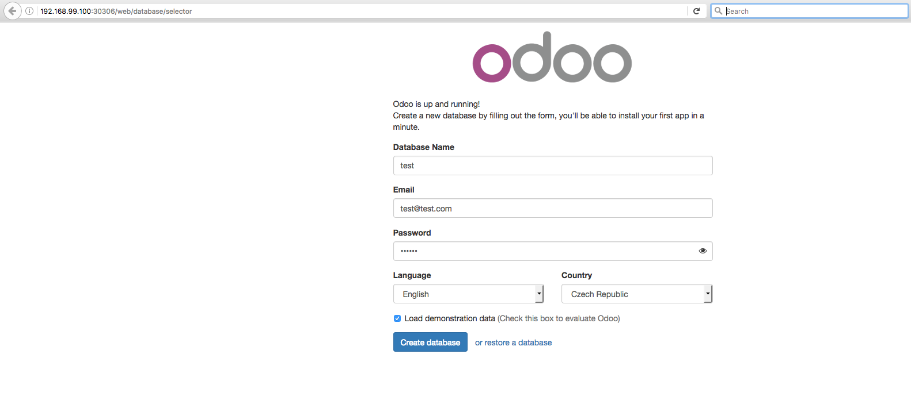
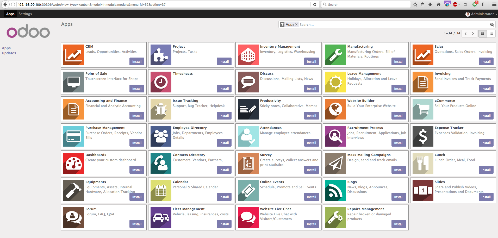
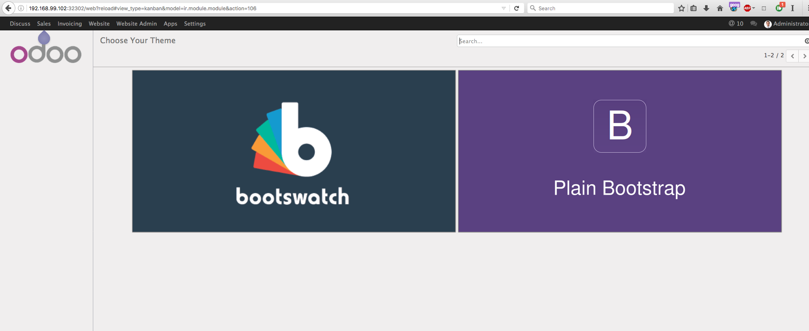
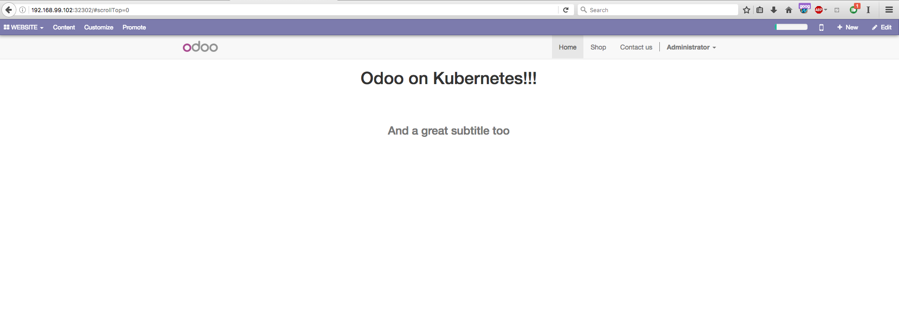

Odoo on kubernetes
---

See what [Odoo](https://github.com/odoo/odoo) is.  
This repository is a showcase deployment of Odoo on a Kubernetes cluster using
[minikube](https://github.com/kubernetes/minikube).  
See [repo instructions](https://github.com/kubernetes/minikube#installation) for setting up minikube.  

###### Note: This example overrides the default `odoo` user specified in `docker.io/odoo:10.0` because the specified volumes for `hostPath` are mounted with root privileges and that doesn't allow a non-privileged user to write to them.

#### Running the example
Download a [release of minikube](https://github.com/kubernetes/minikube/releases).  

```
minikube start

Starting local Kubernetes cluster...
```

Create the Kubernetes `service`, `pv`, `pvc` for both odoo and the postgres db with the `odoo.yaml` file.
```
kubectl apply -f odoo.yaml

service "odoo-db" created
deployment "odoo-db" created
service "odoo-shop" created
deployment "odoo-shop" created
```

Wait for the pods to start before accessing the application.  
```
kubectl get po

NAME                         READY     STATUS              RESTARTS   AGE
odoo-db-3075219300-nx0kw     0/1       ContainerCreating   0          3s
odoo-shop-2676823603-s46lz   0/1       ContainerCreating   0          3s
```

```
kubectl get po

NAME                         READY     STATUS    RESTARTS   AGE
odoo-db-3075219300-nx0kw     1/1       Running   0          1m
odoo-shop-2676823603-s46lz   1/1       Running   0          1m
```

When the pods are ready, you can access the frontend service in the browser.  
```
minikube service odoo-shop

Opening kubernetes service default/odoo-shop in default browser...
```
###### NOTE:

When accessing the service the first time, Odoo starts creating its static files and tries to connect to the database. This might take a while, to see the progress you can tail the logs of the pod. Replace `odoo-shop-2676823603-s46lz` with the container name returned by `kubectl get po` for `odoo-shop` to see the initialization progress.

```
kubectl logs -f odoo-shop-2676823603-s46lz
```


The browser will open with the following page, fill in the details for test data and remember to check `Load demonstration data`.  



`Install` eCommerce (third app down from the right).



Give it a while to load all assets... When prompted, select your theme style.
(either `bootswatch` or `plain bootstrap`)  




And now you can start hacking on your e-shop!  



#### Persistent data
Your changes and data persist between restarts. `minikube stop && minikube start`.
This is because the PVs are mounted in `/data` which is a folder that [minikube keeps](https://github.com/kubernetes/minikube#persistent-volumes).
If you want to eliminate them you have to do `minikube delete` and start your cluster back up.  


##### AWS Integration

This example will have an AWS integration soon.
